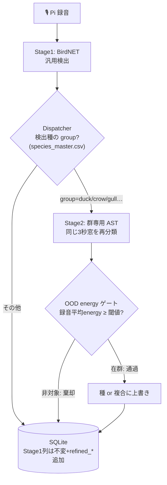

# 1個のモデルを「運用システム」にする — 2段パイプラインと、音では割れない壁　Part4🦆🦅

## はじめに

[Part3](https://qiita.com/mushipi/) では、カモ8〜10種を分類する AST を蒸留・soup・リーク退治と鍛え上げ、最終的に「蒸留なしの soup（`ast-duck-D-base-soup`, honest 録音f1 0.897）」に落ち着きました。

分類のコアはできた。でも、これは**ただの 1 個のモデル**です。私のベランダ録音システム（Raspberry Pi → BirdNET）に、これをどう接いで実際に動かすのか。Part4 はその「**1 個のモデルを運用システムにする**」話です。

> ⚠ 白状すると、[Part2](https://qiita.com/mushipi/items/fb7f4b70b6c58684a5d3) のラストで私は「次は Jetson Nano に載せて TensorRT で…」と宣言していました。**買いませんでした。** 理由は本文で。予告は守れないものですね。

結論を先に言うと、

- 2 段化（BirdNET → 群専用 Stage2）は素直に効いた。**カモ以外は無改修で他の群にも広がる**設計にできた
- 蒸留が本当に効いた理由は精度じゃなく **「GPU なしの CPU で動く」こと**だった
- そして、データを増やしても精度で殴っても**絶対に割れない種のペア**にぶつかる。それを「設計」で受け止めます

お茶、淹れてきてください🍵

---

## 第1章：2段パイプラインの設計

私の運用システムは元々こうでした。

`Pi（マイク）→ 60秒WAV → rsync → BirdNET（汎用6000種）→ SQLite → Web UI`

BirdNET は広く浅く 6000 種を見ますが、近縁カモの細分類は苦手。そこに Stage2 を挿します。



設計でこだわった点が3つ。

**① 群汎用にする。** Dispatcher も Stage2 も DB も、カモ決め打ちにしない。`species_taxonomy.yaml` に「この群はこのモデル・この閾値」を1行登録すれば、**新しい群（カラス・カモメ…）はコード無改修で配線される**。この投資が Part5 で効いてきます。

**② DB は絶対に壊さない。** Stage1 が書いた `species` / `confidence` 列は**不変**。Stage2 の結果は `refined_species` / `refined_energy` / `stage2_model_version` … と**別カラムで追加**します。原本の WAV も消さない。理由は、(a) モデルを改善したら再実行したい、(b) 人手でラベル監査したい、(c) ロールバックしたい、から。**「上書きは正義じゃない」**んです。

**③ 依存の地雷を踏まない。** BirdNET は TensorFlow 系、Stage2 は PyTorch 系。同じ環境に同居させると依存が衝突します。なので Stage2 は**別の venv で subprocess 実行**して隔離しました。

:::note warn
**ハマりどころ**：subprocess で別 venv の python を呼ぶとき、そのパスに `.resolve()` をかけると **symlink が素の system python に解決されて venv が無効化**され、import が全部こけました。symlink のパスはそのまま使うのが正解。地味に溶かしました。
:::

---

## 第2章：蒸留が本当に効いた理由は「CPU で動く」こと

Part3 で「蒸留は精度向上には条件付き」と結論しました。でも、もう一つの価値がここで効きます。

> **蒸留済みの AST は、推論時に教師（重い Perch）が要らない。AST 単体なら CPU で動く。**

私の運用機は CPU マシンです（GPU なし）。Perch は大きく GPU 推奨で、運用機で複数モデルを並べるのは現実的じゃない——これは元々「将来のブロッカー」として認識していた問題でした。蒸留はこれを**消した**わけです。教師を学習時に「飲み込んだ」生徒だけ運ばればいい。

実際に CPU 機で測りました。

| 項目 | 実測（CPU・16スレッド） |
|---|---|
| モデルロード | 0.8 秒 |
| メモリ（RSS→ピーク） | 452MB → 1.4GB |
| **AST 推論** | **109 ms / 3秒チャンク**（8.6 ch/s） |
| 前処理（特徴抽出） | 611 ms / chunk（律速） |

10 分に 1 回のバッチ運用に対して、桁違いの余裕。**Jetson を買う必要が消えました。** エッジ専用ハードに逃げる前に、蒸留で「普通の CPU で足りる」状態にしてしまうのも一つの設計だ、と学びました。

> （図1｜CPU 推論レイテンシ。推論 109ms に対し前処理 611ms が律速。**「重いのはモデルじゃなく前処理」**に注目。in-memory ハンドオフで前処理は削れる余地がある。）

---

## 第3章：エネルギーゲートを「本番の単位」で較正し直す

Stage2 は OOD（BirdNET の誤検出や対象外種）を弾く必要があります。使うのは Part2 でも登場した **energy = T·logsumexp(logits/T)**。energy が高い＝自信あり＝in-distribution、という指標です。

ここで2つ、地味だけど重要な修正を踏みました。

**① 評価の単位を「録音」に揃える。** 旧い閾値は chunk 単位で導出していたのに、本番の `predict.py` は**録音平均**の energy で判定していました。単位がズレていたせいで、**真カモの 32% を誤って棄却**していたんです。録音単位で導出し直しました。

**② モデルを替えたら必ず再導出する。** 運用モデルを `D-base-soup` に替えたら、energy の分布が**上方シフト**しました。古い閾値 2.717 のままだと、**非カモの偽陽性が 0.88**——つまりゲートがほぼ無効。**3.081** に再導出して、真カモ保持 0.90 / 非カモ FP 0.33 に。

:::note warn
⚠️ さらに白状します。この過程で `predict.py` の潜在バグを2つ見つけました。
(1) 設定を group 別構造で読めておらず、**OOD ゲートが実は常時無効**になっていた（カモ群を per-group 構造に再編したときの取り残し）。
(2) 推論モデルが古い固定パスを見ていて、taxonomy の `stage2_model` 指定を無視していた。
「ゲートが効いている」と思い込んでいたものが、実は効いていなかった。**思い込みは測って潰すしかない**。
:::

---

## 第4章：カルガモ壁 — 世界最大級のモデルでも、割れない

ここからが本題かもしれません。

カモ10種のうち、**カルガモ ↔ マガモ** の混同だけが、何をしても消えませんでした。データを増やしても、モデルを soup しても、頑固に残る。これは「我々のデータ/モデルの限界」なのか、それとも「音響的に本質的」なのか——直接、決着をつけにいきました。

使ったのは、教師 **Perch2.0 のネイティブ eBird 分類ヘッド**。これは **14795 クラス**を持ち、**カルガモ専用クラス（spbduc）も持っています**。世界最大級の鳥声データで学習された、専用クラス持ちのモデルです。これを実物のカルガモ/マガモ各 30 録音に当てました。

| | カルガモ録音 | マガモ録音 |
|---|---|---|
| 「自種 vs 相手」2値の勝率 | **0/30** | 30/30 |
| 全クラス argmax = 自種 | **0/30** | 18/30 |
| argmax の行き先 | mallar3（マガモ）=12, ヒヨドリ=12… | mallar3（自種）=18… |

**カルガモは、1 件も「カルガモ」と認識されませんでした。** 全部マガモ側（や別種）に吸収される。一方マガモは健全。これは**非対称な崩壊**です。

> 世界最大級の学習をして、カルガモ専用クラスまで持っている Perch2.0 でさえ、カルガモをマガモから引き剥がせない。

つまり、**カルガモ壁は我々のデータやモデルの問題ではなく、音響的に本質的**でした。カルガモとマガモは交雑するほど近縁で、声がほぼ同一。誰がやっても、音だけでは割れません。

> （図2｜Perch ネイティブヘッドの判定。マガモ録音は自種に当たるのに、**カルガモ録音は専用クラスに 0/30、全部マガモ等に吸収**される非対称崩壊に注目。）

---

## 第5章：割れない壁を「設計」で受け止める（複合クラス）

「割れない」と分かったとき、選択肢は2つあります。

1. モデルを叩き続けて 0/30 を 1/30 にする（＝**死に筋**。誰がやっても無理だと実証済み）
2. **割れないことを認めて、出力の設計で受ける**

選んだのは 2 です。具体的には、**複合クラス（slash 分類群）**。カルガモとマガモを無理に分けず、「**マガモ/カルガモ**」という1つの分類群として出します。

なぜこれが「誠実」なのか。カルガモは国内観察数 3 位の普通種です。音で割れないからと**棄却**してしまうと、カルガモの観察を全部捨てることになる。モデル上カルガモは「Mallard」に化けるので、**Mallard という予測 = この複合分類群を表す**と再ラベルしてやれば、最頻種カルガモを捨てずに表現できます。これは eBird でも使われる慣行です。

設計思想は **「適応的解像度」**。

```
種（既定）        : 音響的に分離できる種は、種名で出す
複合（slash）     : 割れないペアだけ「マガモ/カルガモ」に束ねる
カモ科 sp.（後退） : 低信頼なら属・科レベルに引く（信頼閾値は要キャリブレ）
非カモ（棄却）    : energy ゲートで弾く
```

大事なのは、**複合化は「実測してから」**やること。10種の混同行列を確認したら、構造的に割れないペアは**マガモ/カルガモの1個だけ**でした（他の弱種は小標本の振れ）。だから複合も1個だけ。しかも `species_taxonomy.yaml` に表示ルールを足すだけで、**再学習はゼロ**です。

---

## まとめ：Part4 で学んだこと

**うまくいったこと**
- BirdNET → Dispatcher → 群専用 Stage2 → Energy ゲート、の **2段化を群汎用**で組めた。新しい群は taxonomy に1行で配線される
- 蒸留のおかげで **CPU 運用機にデプロイ可能**になった（Jetson 不要）
- energy ゲートを録音単位で較正し直し、`predict.py` の「効いていなかったゲート」も潰せた

**うまくいかなかった／受け入れたこと**
- **カルガモ壁は消せない**。世界最大級のモデルでも割れない＝音響的に本質的
- 精度で殴るのをやめ、複合クラスという「設計」で受けた
- OOD 閾値は Xeno-canto 域の暫定で、フィールド再較正が前提

教訓はこれです。

> **「割れない」を認めることも、立派な設計判断。**
> モデルを叩いて 0/30 を 1/30 にするより、複合クラスで最頻種を救うほうが、現場では正しい。エンジニアはつい「精度を上げる」に逃げるけれど、解くべきでない問題を見極めるのも仕事。

### Part5 に向けて

カモで「型」ができました。2段パイプライン、CPU デプロイ、energy ゲート、複合クラス。次は——**この型をカラスとカモメに横展開して、「分類器を量産する標準フロー」**を作ります。そして横展開して初めて気づく、こんなことを書きます。

- 1個目で「偶然動いていた」配管が、2個目を通して初めて露わになる
- **群によって「壁」の場所が違う**。カモは種の中（カルガモ壁）、カラスは壁なし、カモメは…？

Part5 をお楽しみに🐦‍⬛🕊

ツッコミ・間違いの指摘、大歓迎です。コメントで教えてください。

---

### 参考文献
- Liu et al., "Energy-based Out-of-distribution Detection", NeurIPS 2020
- Hamer et al., "Perch 2.0 …"（Google の鳥声基盤モデル, ネイティブ eBird ヘッド）
